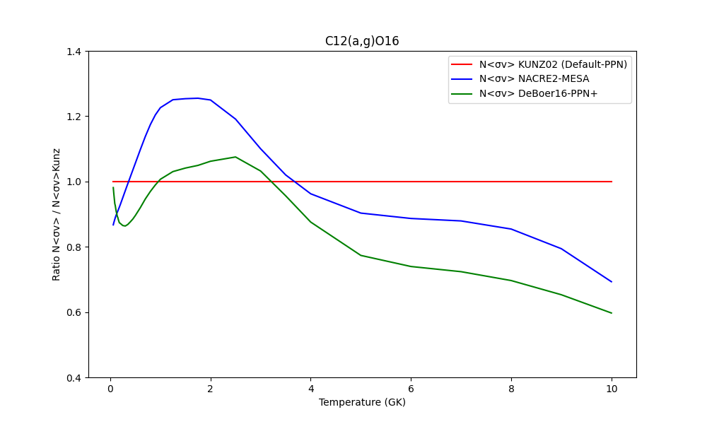

 ### CHANGING / UPDATING NUCLEAR REACTION RATES
(Modular 2 Version) 

2/7/2024 - This documentation will be continually updated. Feel free to add more content and make corrections as needed. (Aishah)

---

**Table of Content**

1. **Modifying Reaction Rate: Applying Multiplication Factors**
   
2. **Changing Nuclear Reaction Sources/References**
   
   - A. REACLIB Database
   - B. Other Nuclear Reactions in VITAL.F90
        - Formula-based Reaction Rates
        - C12-C12 setting
   - C. Changing the KADONIS Table

3. **Custom Ad-Hoc Changes**
   
---

A brief overview of how the physics module operates the nuclear calculations in the PPN (Refer to ppn_physics.F90);


There are several options for changing/updating the reaction rates in the code, and the choice depends on the type of study being conducted. The most basic approach is to examine the /physics/source/physics_knobs.F90 file and identify the switches you can adjust. Below is the default list of settings from physics_knobs. You can modify them as needed and include these settings in your ppn_physics.input file:

```
ininet              = 0 ! 1 = Display all available networks
i_nse               = 0
nse_option          = 0
nvcp                = 57 !number of isotopes 
nrcp                = 110 !number of charged particle reactions 
nnn                 = 1107 !number of isotopes NNN_max = 5235 
tbetamin            = 0.5_r8
index_reaclib       = 2 !0 = 'BASEL', 1 ='JINAR', 2 ='JINAC', 3='JINAV
jbj_mode            = 1 !1 = Oda rate, 2 = JBJ rate, 3 = Oda94+JBJ, 4 = JBJ everywhere
nkk_mode            = 1 !no merging with NKK04 rate 
nse_min_t9          = 6._r8
t9_nw_ini           = 7.8e-3_r8
ye_nw_ini           = 0.5_r8
rho_nw_ini          = 1._r8
use_cache           = .false.
yps_nw_ini(:,:)     = ZERO
detailed_balance    = .true.
screen_option       = CHUGUNOV !'none', 'GRABOSKE' screening, 'CHUGUNOV' screening.
weak_rates          = .true.
strong_rates        = .true.
rate_index(:)       = -1
rate_factor(:)      = ONE
use_other_nuc       = .true.
isomer_choice       = 0 ! 0 = do not include isomers, 1 = include isomers (so far only a few isomers are considered. Check NPDATA/isomers files)
decay               = .false.
decay_time          = 1.e17 ! seconds
kadonis_interp      = 3 ! 1 is linear, 3 is Akima
do_neutrinos        = .false.
```

**1. MODIFYING REACTION RATE: APPLYING MULTIPLICATION FACTORS**

Consider the parameters rate_index and rate_factor above. These are arrays whose sizes are determined by the num_rate_factors parameter, which is set by default to 10 in physics/source/physics_knobs.F90. This setting allows for the modification of up to 10 rates simultaneously during a run. To alter more rates, you would need to adjust the num_rate_factors in physics_knobs.F90 and recompile the code. Before changing anything, print out the networksetup.txt by running the ppn.exe with ininet = 1, which contains all the reactions in the network with their respective indexes shown in the first column. The desired factor can then be applied using rate_factor.

```
#Add the lines in ppn_physics.input
rate_index(1) = 161
rate_factor(1) = 30.0
```

In this example, 161 corresponds to the reaction 13C(p,γ). The 13C(p,γ) rate at all temperatures is multiplied by a factor of 30.

If you want to modify one more rate, let's say you want to double the rate of the 14N(p,γ) whose index in the network is 17, all you need would be the following:

```
rate_index(1) = 161 
rate_factor(1) = 30
     
rate_index(2) = 17 
rate_factor(2) = 2
```

It is important to note that the reactions you are changing must be set to 'T' in the ppn_physics.input file; otherwise, the changes will have no effect. Input from Umberto indicates that with the default settings, enabling this rate as 'T' in ppn_physics.input will implement the NACRE analytic formula; otherwise, the code defaults to NACRE tables. A quick CNO-burning simulation comparing both options shows approximately a 2% difference in the final 13C abundance. If you prefer to use CF88, you must comment out the NACRE option in Vital.F90 and recompile the code before running a new simulation. This change will result in a significant difference in the final 13C abundance, around 20%, due to the use of a completely different rate source, not just a variation in rate interpolation. It's important to note that altering the label/reference in ppn_physics.input directly has no effect, as confirmed by him testing this.

*Hence if one prefers the table instead of the analytic formula, the reactions list in ppn_physics.input must be set to 'F' first.*

**2. CHANGING NUCLEAR REACTION SOURCES / REFERENCES**

- By default, the code sets up the network as follows:
    * Charged particle reactions computed by analytic formula in the VITAL module as per 'T' listed in the ppn_physics.input. 
   
      * However, if 'T' is switched to 'F', the NACRE I (2000) table is being interpolated following the netgen module (Illiadis,2001 table for proton-capture on 20 < A < 40 nuclei)
      * Special reaction, C12-C12 and O16-O16 are sourced from CF88 while 3-Alpha from Fynbo et al. 2005. There is an option to interpolate intermediate C12-C12 rate; a geometric mean between the Wiescher 2016 and CF88.
      * The reaction C12(α,γ)O16 is based on an analytic formula from Kunz et al. 2002 but there is an option for Deboer et al 2016 (Must set in VITAL to be true first).
      * Proton Capture (p,γ) from Iliadis et al. 2010 whenever available.
      * Reverse reactions from the REVERSE module using the principle of detailed balance. Therefore, rates with 'v' flag in REACLIB data must be corrected to include partition function modifications.

   * Neutron capture (n,γ) is interpolated from MAC and SEFT tables in the KADONIS module, and from REACLIB when the reaction is not available.
   * Beta Decay from Fuller & Fowler 1985 (light isotopes, up to Fe) and the rest from Oda et at.1994.

 Example: In Vital.F90
I had added these lines right after V(44) ( correponds to C12(a,g)O16 ) in Vital to override other references and adopt NACRE II following a MESA nuclear reation rate I needed.
 ```
 ! C12(A,G)O16   
 ! Data from Reaclib NACRE-2 
  if (t9 >= 0.01_r8) then
	a0r=2.546340e+02
	a1r=-1.840970e+00
	a2r=1.034110e+02
	a3r=-4.205670e+02                      
	a4r=6.408740e+01
	a5r=-1.246240e+01
	a6r=1.373030e+02

 	N_n44 = a0r + (a1r/t9) + (a2r/TP13) + (a3r*TP13) + (a4r*t9) + (a5r*TP53) + (a6r*lnt9)

	a0r=6.965260e+01
	a1r=-1.392540e+00
	a2r=5.891280e+01
	a3r=-1.482730e+02
	a4r=9.083240e+00
	a5r=-5.410410e-01
	a6r=7.035540e+01
	V_n444 = a0r + (a1r/t9) + (a2r/TP13) + (a3r*TP13) + (a4r*t9) + (a5r*TP53) + (a6r*lnt9)
	V(44) = (exp(N_n44) + exp(V_n444)) * RHO 

    else
	V(44) = ZERO
    end if
 ```                 
- Make sure the reaction is set to 'T' in ppn_physic.input.
- Run with ininet=1.
- Double check if the 'networksetup' reads the reaction with Vital and not NACRR or JINAV/JINAC
- Run again with ininet=3 for full computation.
- Comparison between different references is as follow;
  

 
- **A. REACLIB DATABASE**

To set the Reaclib module to read from a specific REACLIB database, switching the nuclear data source can be done by setting the index_reaclib = '' in the ppn_physics.input. Currently, '2' is the default. You can replace this with another table or simply add another case(4) in the reaclib.F90. Be careful with the new arrays in the new table implementation and corresponding reaclib partition function files (winvn). Below are the available sources:

```
         case(0)
            reacfile = '../NPDATA/REACLIB/reaclib.nosmo'
         case(1)
            reacfile = '../NPDATA/REACLIB/20081109ReaclibV0.5'
         case(2)
            reacfile = '../NPDATA/REACLIB/20120510ReaclibV1.1'
         case(3)
            reacfile = '../NPDATA/REACLIB/results01111258' ! Reaclib version 2.2
```

Note: Setting the file to read from results01111258.data produced an error: 'isotope not found in reaclib hash table4tl20'. UPDATE : I forgot to run with ininet=1 first to define the new isotopes-network before running it again with inenit=3.

Note 2: Tried to replace the reaclib table v2.2 used in Mesa-r10389, but ended with 'bad floating points'. Need to check this. 
UPDATE: Need to update the arrays in parameter.inc for the new table. More isotopes are needed to be defined if new Reaclib table is used.

   - **B. CHANGING OTHER NUCLEAR REACTIONS IN VITAL.F90**

According to Marco Pignatari, it is impossible to read nuclear reactions from only a single source. Vital.F90 computes the charged particle reaction network using a analytic formula and adopts special reaction rates for (3-Alpha, C12-C12, and O16-O16 reactions). Hence,  the formulated reaction rates can be changed or updated manually in the VITAL.F90 (some reactions including C12-C12, and O16-O16 reactions are very outdated). 

Note: 'nrcp' number must be consistent with the 'T' reactions? UPDATE: No need. 'nrcp' number is simply a total number of charged particle reactions.

The vital.F90 works with several subroutines:

- **read_physics_input_data**: This subroutine reads input data related to species and reactions from an input file. It also handles the conversion of half-life units and checks if the isotopes considered are valid.

- **vital_rates_derivs**: This subroutine is a wrapper for calling vital_calculate_rates, which computes the rates of nuclear reactions based on temperature and density inputs.

- **vital_calculate_rates**: This subroutine computes the reaction rates for various nuclear processes, including hydrogen burning, helium burning, carbon burning, and reactions involving heavier elements. It uses temperature and density inputs to determine the rates, applying formulas and interpolating values from pre-calculated tables. Changes can be made here.

The compulsory reaction rates used in the provided code are encapsulated within the vital_calculate_rates subroutine, which is part of the module vital. Below is a list of these reaction rates along with their alternative switching mechanisms as described in the module:

**Formula-based Reaction Rates (Mostly sourced from JINA, CF88, NACRE. Refer to vital.f90 for details and references)**

If there are two/three references used for a reaction, the latter one will be adopted.
 **Hydrogen Burning**

   PP-CHAIN

   CNO Cycle

   Neon-Sodium and Magnesium-Aluminium (Champagne 1994, mostly outdated!)
   
**Helium Burning**

**Reverse Rates**

**Neon Burning**

`NE20(α,γ)MG24` 

**Carbon Burning**
   
Table-interpolation Reaction Rates

`C12(C12,α)NE20` 

`C12(C12,p)NA23` 
 
Default Rate for C12-C12 : CF88 

Alternative : Look for subroutine 'C12C12Inter'
```
../NPDATA/12C+12Crate_new.tex  ! intermediate C12C12 rate Wiescher 2016 and CF88.
```

**Oxygen Burning** 
   
`O16(O16,γ)SI32` ! CF88 formula

**Alternative Switching**
    
 PP-IV Chain: `IPPIV` variable controls the inclusion of the hot H-deficient He3-burning (PP-IV chain).

 C12-Alpha Reactions: Alternative rates for `C12(α,γ)O16` are provided by different studies (CF88, Buchmann 1996, Kunz 2002, and DeBoer+2016). The selection is managed by logical flags and parameters like `Buch` , `Kunz`(default), and `DeBoer`. 

DeBoer is switched off by the flag 'logical:: c12ag_jdb2016 = .false.' and its corresponding file = ../NPDATA/c12ag_jdb16.dat   ! Nobuya Nishimura et al., 2014.

Neon22 reactions: The module allows switching between different sources for reaction rates for `Ne22(α,n)` and `Ne22(α,γ)`, including rates from Michael Wiescher, Longland+2012, and Talwar+2015. 
Default: rate_ne22.dat ! Joachim Gorres, M. Wiescher, G. Imbriani, J. deBoer, and Mary Beard, 2014

Alternative sources for Ne22 rates in the VITAL.F90. Change to 'T' with your preference or replace with your own file: 

```
   logical:: ne22_michael = .false.
   logical:: ne22_longland = .false.
   logical:: ne22_nd2015 = .false.
   
Corresponding file respectively:
../NPDATA/ag_lo12.dat ! Longland et al., 2012
../NPDATA/an_lo12.dat ! Longland et al., 2012
../NPDATA/ne22a_mw15.dat ! Talwar et al., 2015
```
- C12-C12 Setting
  
The C12+C12 reaction rate is comprehensively evaluated in vital.f90, specifically within the code section indicated below:
pic1

As you can see,  v(59), v(60), and v(61) represent the reaction rates for the p-, alpha-, and n-channels, respectively. Each requires the c12c12 variable, which denotes the total rate. As mentioned last week, this is calculated using the CF88 analytic formula.
pic2

Additionally, one can utilize the rate from Michael Wiescher or an intermediate rate between Wiescher's upper value and CF88. To employ Michael Wiescher's rate, it is necessary to uncomment the specified line.
pic 3

Specifically, to calculate C12C12W, mppnp requires the array values of c12tab(1:nc12, i), with nc12 set to 3 and i representing temperature values. The values of nc12=1, 2, or 3 correspond to the recommended, lower, and upper limits of Wiescher's rate, respectively, which are read from "NPDATA/12C+12Crate_new.tex". It is important to note that uncommenting the relevant lines as they stand will result in the use of the upper limit. 

Additionally, the comment lines immediately preceding the necessary line for utilizing Wiescher's rate appear to be incorrect.
pic4
If I have interpreted the code correctly, c12c12w(1), c12c12w(2), and c12c12w(3) represent the upper limits of the total, alpha, and p-channel, respectively, rather than the recommended, lower, and upper limits of the total rate. This interpretation aligns with the debugging print options displayed in the screenshot, particularly the printing of c12c12(2)+c12c12(3) to presumably confirm that it equals c12c12(1), which is the total rate.

As illustrated in the first screenshot, the total rate is utilized to calculate the various channels by applying three distinct factors: BRCCN, BRCCP, and BRCCA. BRCCN is assessed in the top half of the first screenshot, while BRCCP and BRCCA are set as parameters at 0.35 and 0.65, respectively


   - **C. CHANGING THE KADONIS REACTION RATES**

Refer to Kadonis.F90 and one could update the Kadonis table/data as needed. Some reactions have more than one database and only the latter one will be adopted in the calculation. Be careful with the number of rows with the new table/data implementation.

**3. CUSTOM AD-HOC CHANGES** 

This section in vital.F90 is implemented in order to allow for quick ad-hoc rates to be applied to the code, not a permanent addition or compilation.

Look for subroutine N14TEST(t9, rateout) and modify accordingly. (Haven't checked the success of it yet.Maybe others can verify this)
